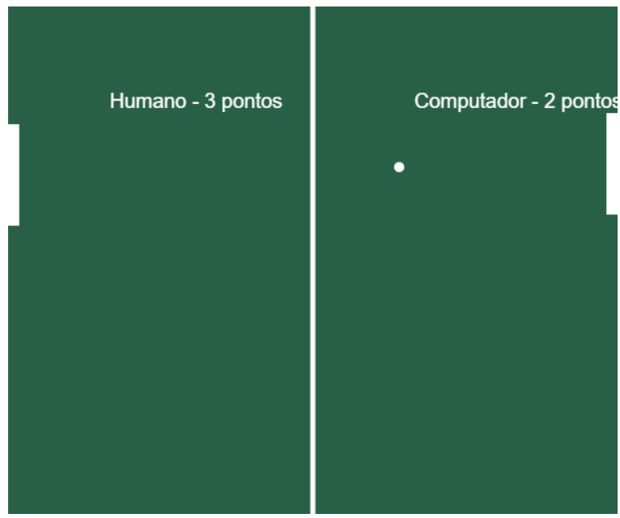

# 🏓 Jogo de Tênis Retro (Ping Pong)

> Recriação do clássico jogo Pong utilizando HTML5 Canvas e Lógica de Programação em JavaScript.

## 💻 Sobre o Projeto

Este projeto consiste em um jogo de "Tênis" (ou Ping Pong) desenvolvido do zero, sem o uso de bibliotecas de jogos (game engines). O objetivo foi aprofundar o conhecimento na manipulação do elemento `<canvas>` do HTML5 e implementar a lógica de um jogo em tempo real.

O jogo apresenta:
* **Renderização Gráfica:** Desenho do campo, rede, raquetes e bola via código.
* **Inteligência Artificial Básica:** A raquete do oponente (computador) segue a bola automaticamente.
* **Física de Colisão:** Lógica matemática para calcular o rebote da bola nas paredes e nas raquetes.
* **Sistema de Pontuação:** Contagem de pontos dinâmica.

## 🎮 Como Jogar

1.  Abra o jogo no navegador.
2.  Controle a **raquete esquerda** movendo o **mouse** para cima e para baixo.
3.  O objetivo é rebater a bola e fazer com que ela passe pela raquete do adversário (computador).

## 📸 Gameplay

  

---

## 🛠 Tecnologias e Conceitos

* **HTML5 Canvas:** Utilizado para desenhar todos os elementos gráficos (`getContext('2d')`, `fillRect`, `arc`).
* **JavaScript:**
    * `window.onload` e `setInterval`: Criação do "Game Loop" (o jogo roda a 30 quadros por segundo).
    * `addEventListener('mousemove')`: Captura da entrada do usuário.
    * **Lógica Condicional:** Cálculos de posição (`X` e `Y`) para verificar se a bola tocou nas bordas ou nas raquetes.

## 🚀 Como rodar o projeto

1.  Clone este repositório ou baixe o arquivo `.html`.
2.  Basta abrir o arquivo `index.html` em qualquer navegador moderno (Chrome, Firefox, Edge).
3.  Divirta-se!

## 👩‍💻 Autora

**Isabelle Pantoja**

---
*Projeto desenvolvido para estudo de Lógica de Programação e Canvas API.* 🚀
